# DDGorgeous

This repo contains implementations of a collection of discrete differnetial geometry algorithms. They are based on a [C++ skeleton code](https://github.com/GeometryCollective/ddg-exercises) for course assignments from [Discrete Differential Geometry](https://brickisland.net/DDGSpring2020/) (15-458/858).

This code framework uses [Geometry Central](https://github.com/nmwsharp/geometry-central) for geometry processing utilities and [Polyscope](https://github.com/nmwsharp/polyscope) for visualization, which were developed by Nick Sharp and others in the [Geometry Collective](http://geometry.cs.cmu.edu/). Also, It must be acknowledged that most of the illustrations used in this readme come from the course notes text provided with the mentioned course by Keenan Crane.

## Results

|                                                                                                                                                                                                                                                                     Algorithm                                                                                                                                                                                                                                                                     |                                                                                                                                                                                                                                              Result (GIF)                                                                                                                                                                                                                                              |
| :-----------------------------------------------------------------------------------------------------------------------------------------------------------------------------------------------------------------------------------------------------------------------------------------------------------------------------------------------------------------------------------------------------------------------------------------------------------------------------------------------------------------------------------------------: | :-----------------------------------------------------------------------------------------------------------------------------------------------------------------------------------------------------------------------------------------------------------------------------------------------------------------------------------------------------------------------------------------------------------------------------------------------------------------------------------------------------: |
|                                                                                                                                                  **Simplicial Complex Operations (Star, Closure, Link, Boundary)** 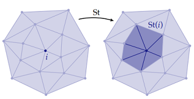 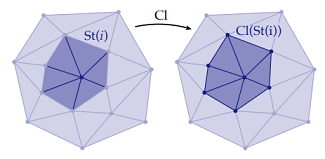 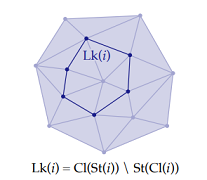 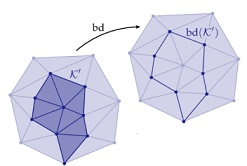                                                                                                                                                  |                                                                                                                                                                                                             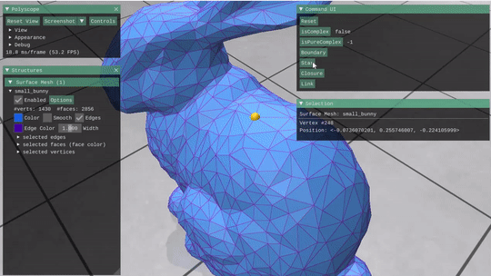 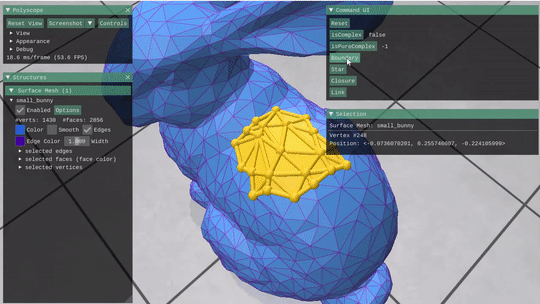                                                                                                                                                                                                             |
|                                                                                                                                                                                        **Discrete Exterior Calculus Operators (Exterior Deravtive, Hodge Star)** 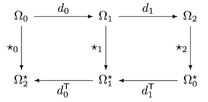 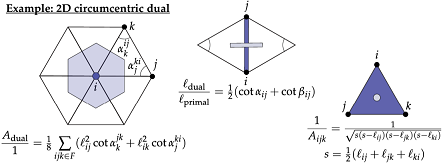                                                                                                                                                                                        |                                                                                                                                                                                                                                  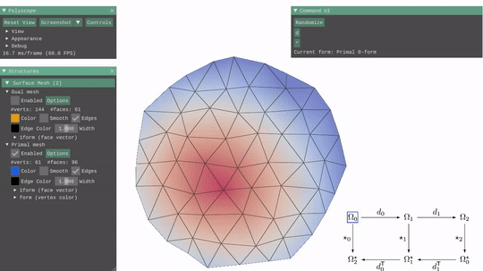                                                                                                                                                                                                                                  |
|                                                                                                                                                                                                                       **Vertex Normal Computation Methods  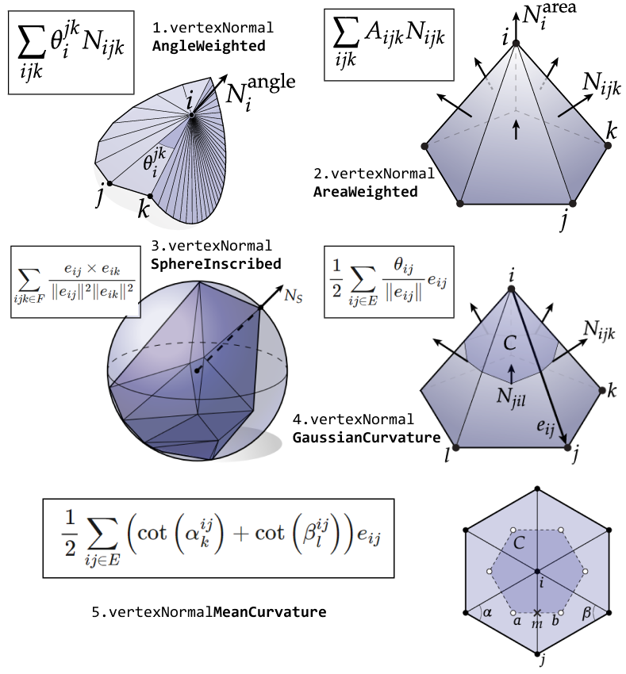**                                                                                                                                                                                                                       |                                                                                                                                                                                                                             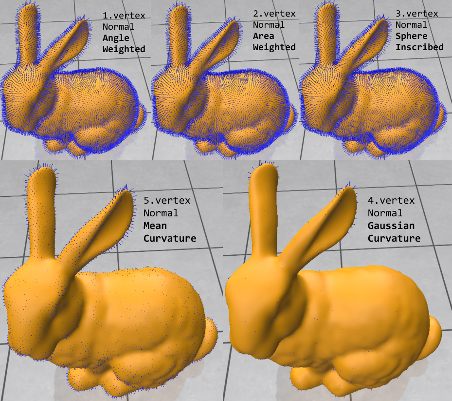                                                                                                                                                                                                                             |
|                                                                                                                                                                                                                         **Curvature Computation Methods  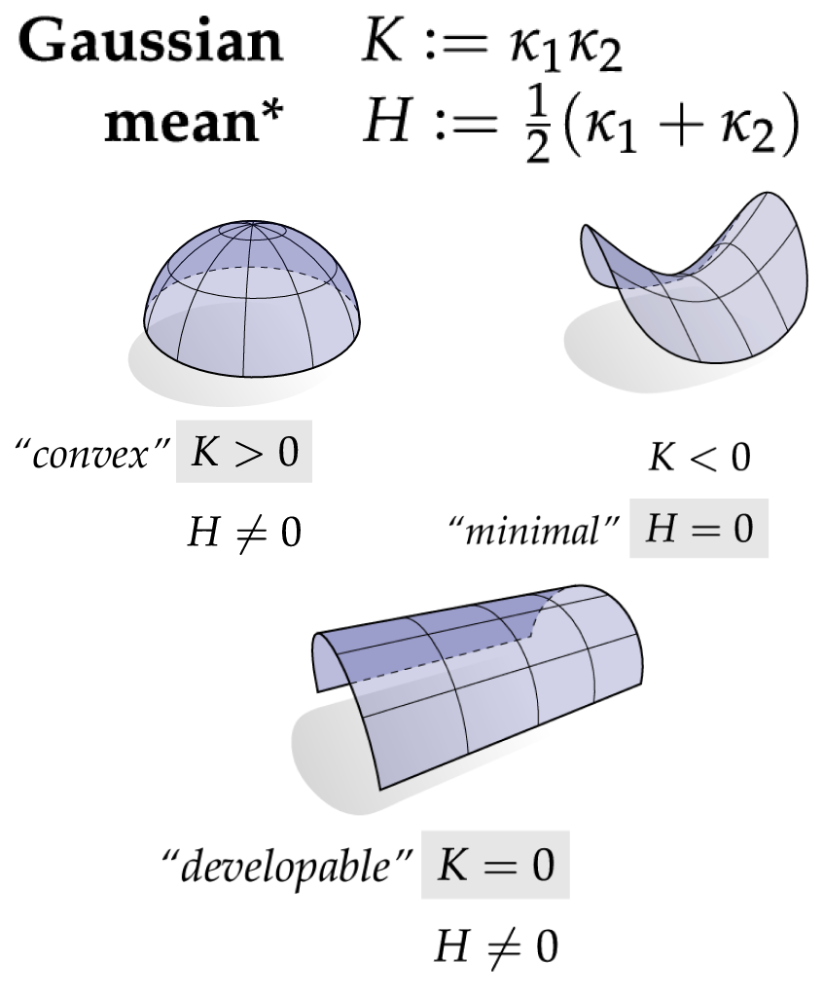**                                                                                                                                                                                                                         |                                                                                                                                                                **kmin & kmax:** 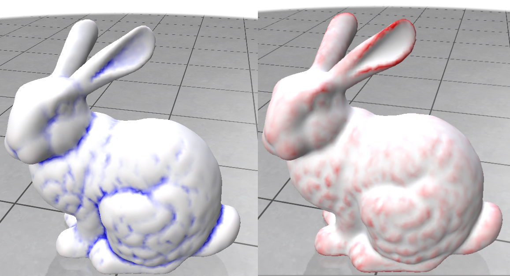 **Mean & Gaussian Curvature:** 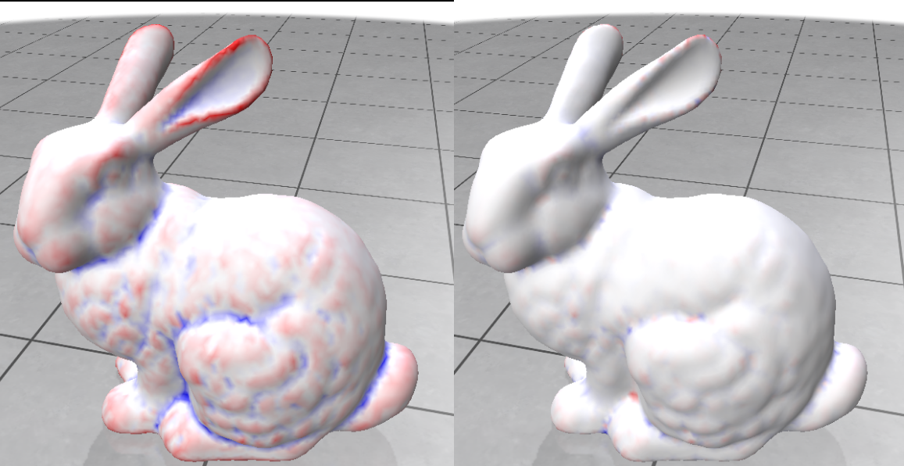                                                                                                                                                                |
|                                                                                                                                                                                                                               **Poisson Equation  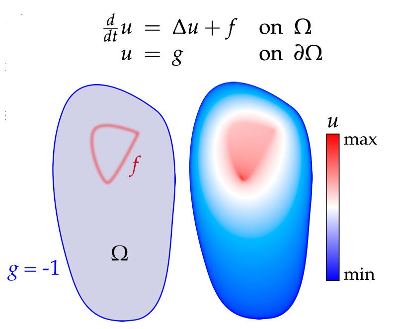**                                                                                                                                                                                                                               |                                                                                                                                                                                                                             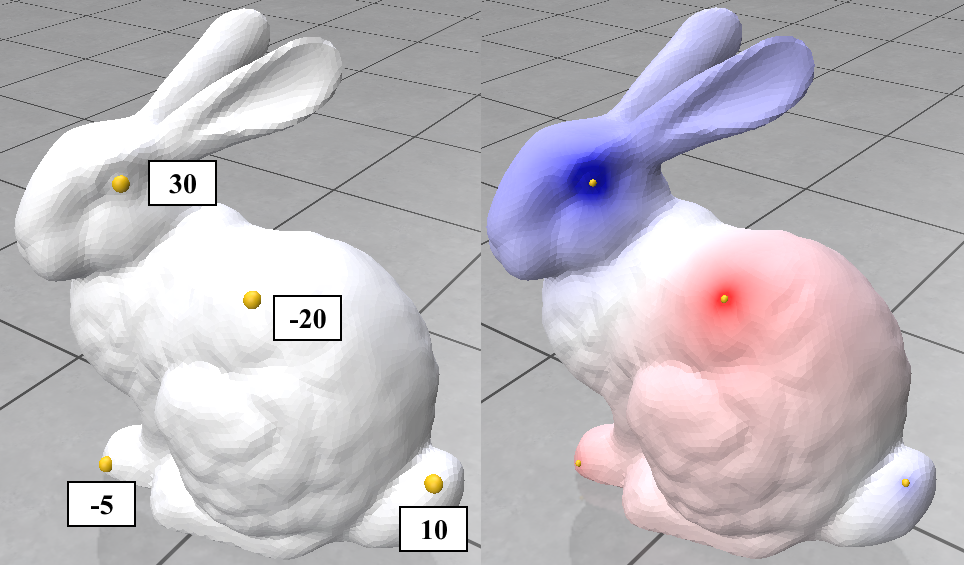                                                                                                                                                                                                                             |
|                                                                                                                                                                                                                        **Smoothing using Curvature Flows  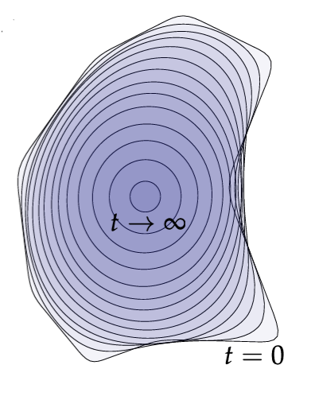**                                                                                                                                                                                                                        | **Mean Curvature Flow** (11 iterations) (Updating Laplace Matrix in each iteration Vs using the initial one) *Using the initial matrix (only updating mass matrix) helps with avoiding singularities* 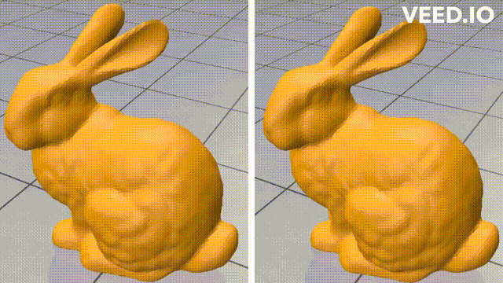  **Stationary-Laplacian Mean Curvature flow** (~ 40 iterations, step size 0.001 vs 11 with step size 0.01) *step size affects speed of convergance* 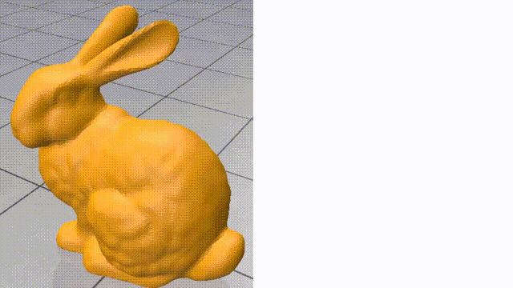 |
| **Geodesics using**[ the Heat Method](https://www.cs.cmu.edu/~kmcrane/Projects/HeatMethod/)  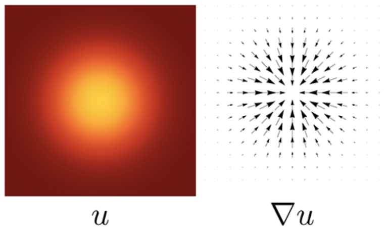 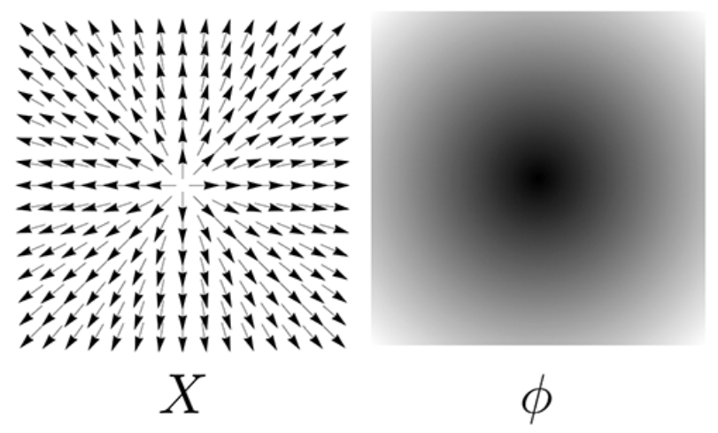 Outline of the heat method.  (I) Heat is allowed to diffuse for short time (top-left).  (II) The temperature gradient (top-right)  is normalized & negated to get a vector field (bottom-left) pointing along geodesics.  (III) A function whose gradient follows recovers the final distance (bottom-right). |                                                                                                                                                                                                                             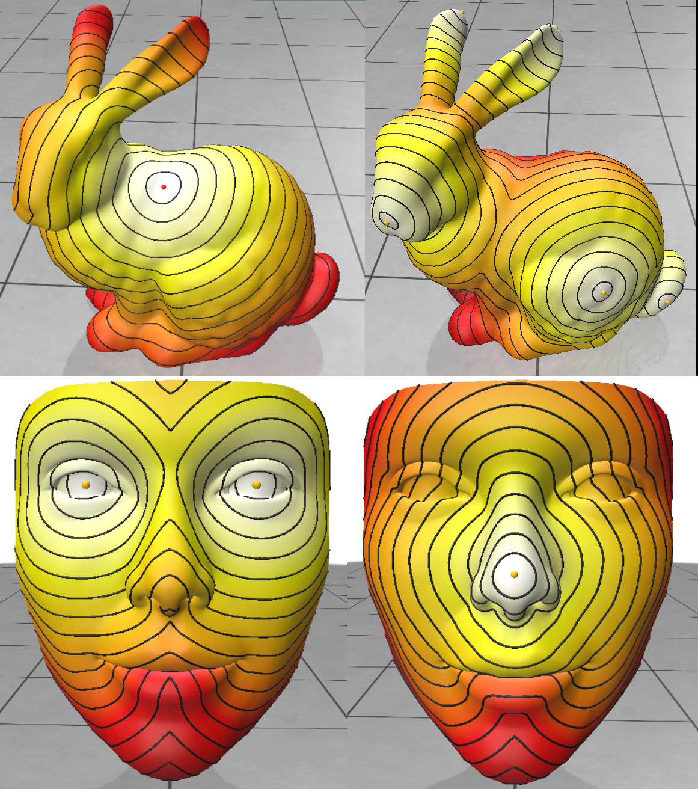                                                                                                                                                                                                                             |
|                                                                                                                                                                                                                                                                                                                                                                                                                                                                                                                                                  |                                                                                                                                                                                                                                                                                                                                                                                                                                                                                                        |

## Dependencies (all included)

1. Geometry processing and linear algebra - [Geometry Central](https://github.com/nmwsharp/geometry-central), which in turn has dependencies on [Eigen](https://eigen.tuxfamily.org) and/or [Suitesparse](https://people.engr.tamu.edu/davis/suitesparse.html).
2. Visualization - [Polyscope](https://github.com/nmwsharp/polyscope)
3. Unit tests - [Google Test](https://github.com/google/googletest)
