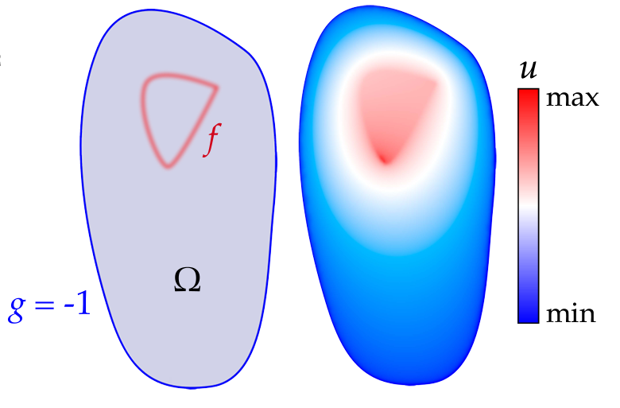
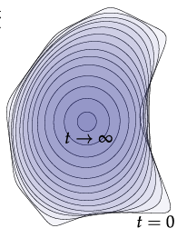

# DDGorgeous

This repo contains implementations of a collection of discrete differnetial geometry algorithms. They are based on a [C++ skeleton code](https://github.com/GeometryCollective/ddg-exercises) for course assignments from [Discrete Differential Geometry](https://brickisland.net/DDGSpring2020/) (15-458/858).

This code framework uses [Geometry Central](https://github.com/nmwsharp/geometry-central) for geometry processing utilities and [Polyscope](https://github.com/nmwsharp/polyscope) for visualization, which were developed by Nick Sharp and others in the [Geometry Collective](http://geometry.cs.cmu.edu/). Also, It must be acknowledged that most of the illustrations used in this readme are from the notes paper provided with the mentioned course by Keenan Crane.

## Results

|                                                                                                                                                                                                                                                                       Algorithm                                                                                                                                                                                                                                                                       |                                                                                                                                                                                                                                                         Result (GIF)                                                                                                                                                                                                                                                         |
| :---------------------------------------------------------------------------------------------------------------------------------------------------------------------------------------------------------------------------------------------------------------------------------------------------------------------------------------------------------------------------------------------------------------------------------------------------------------------------------------------------------------------------------------------------: | :--------------------------------------------------------------------------------------------------------------------------------------------------------------------------------------------------------------------------------------------------------------------------------------------------------------------------------------------------------------------------------------------------------------------------------------------------------------------------------------------------------------------------: |
|                                                                                                                                                    **Simplicial Complex Operations (Star, Closure, Link, Boundary)**                                                                                                                                                        |                                                                                                                                                                                                                                                                                                                                                                                                                                                 |
|                                                                                                                                                                                          **Discrete Exterior Calculus Operators (Exterior Deravtive, Hodge Star)**                                                                                                                                                                                            |                                                                                                                                                                                                                                                                                                                                                                                                                                                                                          |
|                                                                                                                                                                                                                            **Vertex Normal Computation Methods **                                                                                                                                                                                                                            |                                                                                                                                                                                                                                                                                                                                                                                                                                                                                |
|                                                                                                                                                                                                                              **Curvature Computation Methods **                                                                                                                                                                                                                              |                                                                                                                                                                           **kmin & kmax:**  **Mean & Gaussian Curvature:**                                                                                                                                                                            |
|                                                                                                                                                                                                                                         Poisson Equation                                                                                                                                                                                                                                          |                                                                                                                                                                                                                                                                                                                                                                                                                                                                                                                              |
|                                                                                                                                                                                                                                          Curvature Flows                                                                                                                                                                                                                                           | Mean Curvature Flow (11 iterations)) (Updating Laplace Matrix with each iteration Vs using the initial one (stationary matrix))) *Using the initial matrix while only updating mass matrixhelps with avoidung singularities*   Stationary-Laplacian Mean Curvature flow (~ 40 iterations with step size 0.001 vs 11 iterations with step size 0.01)) *step size affects speed of convergance*  |
| Geodesics via[ the heat method](https://www.cs.cmu.edu/~kmcrane/Projects/HeatMethod/)    Outline of the heat method.  (I) Heat is allowed to diffuse for a brief period of time (top-left).  (II) The temperature gradient (top-right)  is normalized and negated to get a unit vector field (bottom-left) pointing along geodesics.  (III) A function whose gradient follows recovers the final distance (bottom-right). |                                                                                                                                                                                                                                                                                                                                                                                                                                                                                |
|                                                                                                                                                                                                                                                                                                                                                                                                                                                                                                                                                      |                                                                                                                                                                                                                                                                                                                                                                                                                                                                                                                              |

## Dependencies (all included)

1. Geometry processing and linear algebra - [Geometry Central](https://github.com/nmwsharp/geometry-central), which in turn has dependencies on [Eigen](https://eigen.tuxfamily.org) and/or [Suitesparse](https://people.engr.tamu.edu/davis/suitesparse.html).
2. Visualization - [Polyscope](https://github.com/nmwsharp/polyscope)
3. Unit tests - [Google Test](https://github.com/google/googletest)
