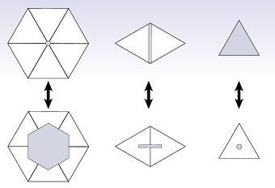

# DDGorgeous

This repo contains implementations of a collection of discrete differnetial geometry algorithms. They are based on a [C++ skeleton code](https://github.com/GeometryCollective/ddg-exercises) for the course assignments from [Discrete Differential Geometry](https://brickisland.net/DDGSpring2020/) (15-458/858).

This code framework uses [Geometry Central](https://github.com/nmwsharp/geometry-central) for geometry processing utilities and [Polyscope](https://github.com/nmwsharp/polyscope) for visualization, which were developed by Nick Sharp and others in the [Geometry Collective](http://geometry.cs.cmu.edu/). Also, It must be acknowledged that most of the illustrations used in this readme come from the course notes text provided with the mentioned course by Keenan Crane.

## Results

Below are the highlights of the implemented algorithms.

### 1. Simplicial Complex Operations

 
 
Given a mesh stored as a Halfedge structure, this part required building the incidence matrices and vector encodings for the mesh and its elements. These were then used to implement simple selection operations like Closure, Star, Link and boundary, as well as some simple boolen checks on a subcomplex of the mesh (`isComplex` and `isPureComplex`)

|                                                                                                                               Operator                                                                                                                               |                                                                             Results (GIF)                                                                             |
| :-------------------------------------------------------------------------------------------------------------------------------------------------------------------------------------------------------------------------------------------------------------------: | :-------------------------------------------------------------------------------------------------------------------------------------------------------------------: |
|                                                                             **Star & Closure**                                                                               |                                   Can use them together repeateadly to grow a selection.                                    |
| **Link & Boundary**   | Can think of as an exclusive vs inclusive boundaries  |

### 2. Discrete Exterior Calculus Operators

|                                                                     Operator                                                                     |            Results (GIF)            |
| :-----------------------------------------------------------------------------------------------------------------------------------------------: | :----------------------------------: |
| **Exterior Deravtive & Hodge Star**   |  |

### 3. Normals & Curvatures

|                                               Algorithm                                               |                                                                                 Results                                                                                 |
| :---------------------------------------------------------------------------------------------------: | :----------------------------------------------------------------------------------------------------------------------------------------------------------------------: |
| **Vertex Normal Computation Methods  ** |                                                                                                                            |
|     **Curvatures Computation   **     | **kmin & kmax:**  **Mean & Gaussian Curvature:**  |

### 4. The Laplace-Beltrami Operator & its Applications

|                                              Algorithm                                              |                                                                                                                                                                                                                                              Results (GIF)                                                                                                                                                                                                                                              |
| :-------------------------------------------------------------------------------------------------: | :-----------------------------------------------------------------------------------------------------------------------------------------------------------------------------------------------------------------------------------------------------------------------------------------------------------------------------------------------------------------------------------------------------------------------------------------------------------------------------------------------------: |
|        **Poisson Equation  **        |                                                                                                                                                                                                                                                                                                                                                                                                                                                          |
| **Smoothing using Curvature Flows  ** | **Mean Curvature Flow** (11 iterations) (Updating Laplace Matrix in each iteration Vs using the initial one) *Using the initial matrix (only updating mass matrix) helps with avoiding singularities*   **Stationary-Laplacian Mean Curvature flow** (~ 40 iterations, step size 0.001 vs 11 with step size 0.01) *step size affects speed of convergance*  |
|                             **Conformal Parameterization**                              |                                                                                                                                                                                                                                                                                                                                                                                                                                                                                                        |

### 5. Geodesics: The Heat Method

|                                                                                                                                                                                                                                                                     Algorithm                                                                                                                                                                                                                                                                     |                 Results (GIF)                 |
| :-----------------------------------------------------------------------------------------------------------------------------------------------------------------------------------------------------------------------------------------------------------------------------------------------------------------------------------------------------------------------------------------------------------------------------------------------------------------------------------------------------------------------------------------------: | :--------------------------------------------: |
| **Geodesics using**[ the Heat Method](https://www.cs.cmu.edu/~kmcrane/Projects/HeatMethod/)    Outline of the heat method.  (I) Heat is allowed to diffuse for short time (top-left).  (II) The temperature gradient (top-right)  is normalized & negated to get a vector field (bottom-left) pointing along geodesics.  (III) A function whose gradient follows recovers the final distance (bottom-right). |  |

## Dependencies (all included)

1. Geometry processing and linear algebra - [Geometry Central](https://github.com/nmwsharp/geometry-central), which in turn has dependencies on [Eigen](https://eigen.tuxfamily.org) and/or [Suitesparse](https://people.engr.tamu.edu/davis/suitesparse.html).
2. Visualization - [Polyscope](https://github.com/nmwsharp/polyscope)
3. Unit tests - [Google Test](https://github.com/google/googletest)
