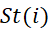
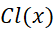
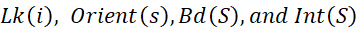
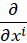
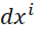

# Discrete Differential Geometry - Reading Summaries

[CARNEGIE MELLON UNIVERSITY - CS 15-458/858](https://brickisland.net/DDGSpring2021/)

[**Reading #1 - A Glimpse into Discrete Differential Geometry**](https://www.ams.org/publications/journals/notices/201710/rnoti-p1153.pdf)

DDG studies differential geometry in the discrete setting, linking analytical definitions &amp; computation and preserving invariants and global properties of geometry in the discrete setting. This is done by studying different but equivalent definitions from smooth settings on discrete objects and comparing the resulting definitions, often not equivalent. An example of this is the curvature of a discrete curve where we get 4 different definitions from 4 equivalent ones, interestingly (but not rarely), none of them is ideal, however, each one is suitable for specific tasks.

It was certainly interesting how the discrete analog of the Steiner formula came down to the same discrete definition with the Turning angle once, Length Variation, and a new different one based on the different chosen shape for connecting lines at corners.

[**Reading #2 - Combinatorial Surfaces (P7-20)**](http://www.cs.cmu.edu/~kmcrane/Projects/DDG/paper.pdf)

We study simplicial complexes and simplices describing only shapes&#39; connectivity in the 2D setting with the assumption of Manifolds; as means to describe surfaces in the discrete setting, analogous to topological surfaces in the smooth setting. Some set operators are defined for simplicial complexes to describe certain connectivity properties, like  (the star is all simplices that contain i),  (the closure of a set of simplices is the smallest simplicial complex including them), . The data structures used to represent such surfaces are adjacency matrices and half-edge meshes, while adj matrices are very fast in finding neighbors and more generic, they are very costly in storage and editing time, unlike half-edge meshes, which are the standard data structure.

Something that I will certainly look more into is what data structures analogous to half-edge meshes that are used to represent tetrahedral meshes.

[**Reading #3 - Exterior Algebra and k-Forms - (P45-65)**](http://www.cs.cmu.edu/~kmcrane/Projects/DDG/paper.pdf)

k-vectors are analogous to regular vectors in the sense that they are an oriented measurement of a k-volume in the k-dimensional span in a similar way to how vectors measure lengths (1-volume) and oriented directions of the span of the same vector, i.e. the straight line containing it. The ⋆ (hodge star)and ∧ (wedge product) () operators enable us to manipulate the dimension of our k-vectors by wedging k-vectors together to build higher-order ones or getting a complimentary (n-k)-vector of a given k-vector, these 2 operators are closely related with common concepts, and operators in linear algebra like cross products, orthogonality, norms, and others. K-forms (k-covectors) are very similar to k-vectors except that they are used as a measurement device of k-vectors, along with the ♯ (sharp) and ♭ (flat) operators used to convert between the two domains, the  and  symbols used as coordinates for the k-vector fields and k-form &quot;fields&quot; respectively.

Now, I am very excited to resume studying introductory group theory as I think a better understanding of permutations would go so far with deeply understanding the Hodge star and Wedge product operators.

[**Reading #4 - Exterior Calculus - (P67-83)**](http://www.cs.cmu.edu/~kmcrane/Projects/DDG/paper.pdf)

In this part, we use the Hodge, Wedge, Flat &amp; Sharp operators and define the differential operator in order to generalize most of the calculus operators, i.e. gradient, divergence, curl, and theorems, i.e. Stoķe&#39;s theorem which generalizes most central theorems in vector calculus, to all sorts of curved spaces. These definitions simplify in the discrete setting where integrated k-forms are stored on simplices in simplicial complexes &amp; use chains and co-chains to play the role of co-vectors measuring vector fields in the smooth setting. Translating the Hodge star operator to the discrete setting yields dual (n-k)-forms which capture the component describing orthogonality between mesh elements which was lost as we discretized forms from the smooth setting.

I found dual meshes to be very interesting and I&#39;m very excited to learn more about them.

[**Reading #5 – Curves and Surfaces - (P28-44)**](http://www.cs.cmu.edu/~kmcrane/Projects/DDG/paper.pdf)

Surfaces can be represented in various ways, a useful one of which is by a map f from plane to space, alonge with an induced metric g describing how tangent vectors in the plane get stretched out by the map f.
